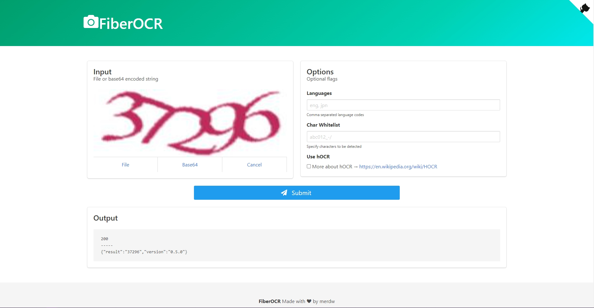

# FiberOCR
## Overview:
This lightweight and efficient OCR API server, developed in Golang using the Fiber framework, empowers developers to seamlessly convert images to text and extract content from captchas. Whether you're working on document digitization, automated data extraction, or captcha solving, our API provides a reliable solution with minimal dependencies.

## Key Features:

**Image-to-Text Conversion:** Transform images containing textual content into machine-readable text effortlessly.

**Captcha-to-Text:** Tackle captchas head-on by utilizing our OCR capabilities to decipher and extract text from basic captcha images.

**Golang & Fiber:** Benefit from the speed and simplicity of Golang combined with the expressiveness of the Fiber web framework, ensuring a robust and performant API.

# Deploy to Heroku

```sh
# Get the code
% git clone git@github.com:merdw/fiberocr.git
% cd fiberocr
# Make your app
% heroku login
% heroku create
# Deploy the container
% heroku container:login
% heroku container:push web
# Enjoy it!
% heroku open
```

[heroku cli](https://devcenter.heroku.com/articles/heroku-cli#download-and-install)


# Contributing:
We welcome contributions! Whether you find a bug, have a feature request, or want to improve documentation, feel free to submit a pull request.
# Quick Start

## Development with Docker Image

```sh
% docker-compose up
# open http://localhost:8080
```

If you need more languages

```sh
% docker-compose build --build-arg LOAD_LANG=tur
% docker-compose up
```
Check your language: [Languages](https://tesseract-ocr.github.io/tessdoc/Data-Files-in-different-versions.html)

## Manual Setup

If you have tesseract-ocr and library files on your machine

```sh
% go install github.com/merdw/fiberocr@latest
% PORT=8080 fiberocr
# open http://localhost:8080
```

# Documents
## API ENDPOINTS
# GET `/`

- Render working example page with GUI
- Response content-type: `text/html`
# POST `/file`
- Execute OCR with file sent by `multipart/form-data`
- Response content-type: `application/json`

```sh
# Request
curl -XPOST "http://localhost:8080/file" \
-F "file=@sample.png" \
-H "Content-Type: multipart/form-data"
```
```sh
# Response
{
	"result": "2,448 total",
	"version": "0.0.5",
}
```


# POST `/base64`

- Execute OCR with base64 encoded image data
- Response content-type: `application/json`

```sh
# Request
curl -XPOST "http://localhost:8080/base64" \
-d '{
	"base64": "iVBORw0KGgoAAAANSUhEUgAAACEAAAAOCAYAAAChHnWMAAACtElEQVQ4T82VPUhyYRTH/7eSorbIaiilxVWLhhwKiaRB3EQQijbzI9uiDxz8IISiQs2MshYxCNoaAxebgoYMclEiQigqqqUoUl/OgWteTV54l7ezPc99Pn7P/3/OuUKpVCrhP4fw6yBubm6wu7uLh4cH1qazsxMmkwlqtVqi1ePjI/b395HL5Xi+o6MDVqsVSqWSx3d3dzg+PpbsEQQBKpUKg4ODaG1tlX4TlTg9PUU8HgctNpvNvJDGX19fGBgYwPT0NG9Mp9OIRCJoaGjA5OQkmpqacHBwgPf3d9jtdmg0GmSzWayurqK3t5fPo3h7ewPBNzc3Y2NjA42NjWUQtoMucjqd6O7uhtfrlVDSYXSo2+1GT08PHA4HXxwOhyXrZmZmGHh7e7sMEY1GGVaMl5cXzM/PIxAIoL29XQpxeHiIZDJZ85FWFYtFfuHo6CjGxsawtLQEn8+Hrq4uCcT9/T2ur68xNDRUF+Lj4wOzs7NYXl5mC8VgJUKhEPsbDAZ/rBOCIL/1ej12dnawubkJmUxWt6ZEO9bW1spKkAqkMtlAKtbYsbKygnw+/1eI8fFxlntra0tySDWNCPETZX9/P2w2W21ikhKZTKaccNWbKSlHRkbYEo/H86MSVFnr6+v8EBGCYMWcoHYUi8Vwfn4Ouo8SVGLH1dUVb7ZYLNDpdBKGk5MTHB0dYW5uDgqFAi6XiyuALKqMxcVFvL6+skoiRHViPj8/Y2Fhge9qaWmRQtCIsr5QKHBfIO8pUqkUEokE5HI5/H4/z+3t7eHs7AxarRZTU1M8R5ddXFyUH1EPQkxMUqytra0WggCodG5vbyUv7OvrY/rKoMS8vLz8PkQQYDAYYDQaea4exOfnJys5PDyMiYmJWghxhpoONRUK6piV3lWC0Kuenp5AXlO5Uu/41/gV/44/SvNv5iv8RRoAAAAASUVORK5CYII=",
	"trim":"\n"
}'
```sh
{
	"result": "OCR",
	"version": "0.0.5",
}
```


# GET `/status`

- Returns application version
- Response content-type: `application/json`

```sh
# Request
% curl -XGET "http://localhost:8080/status"

# Response
{"message":"Hello!","version":"0.0.5"}
```
